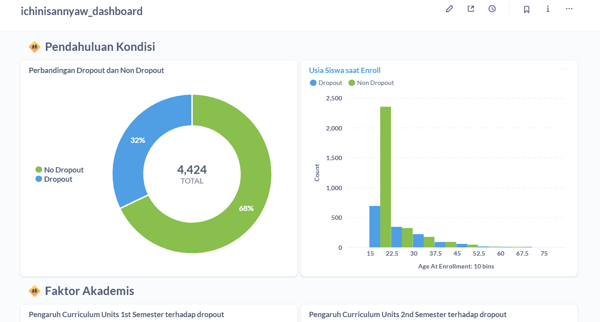
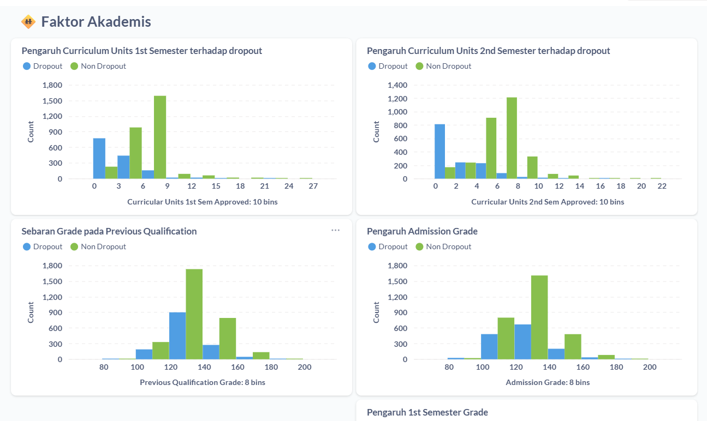
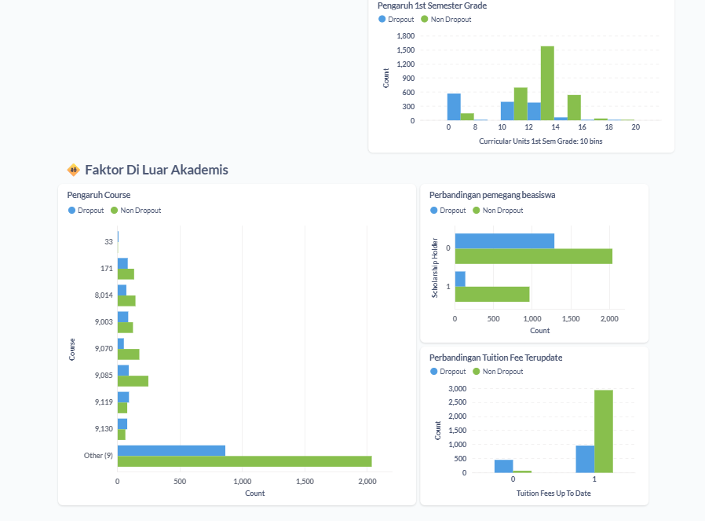

# Proyek Akhir: Menyelesaikan Permasalahan Perusahaan Edutech

## Business Understanding

### Latar Belakang
Jaya Jaya Institut adalah institusi pendidikan tinggi yang berdiri sejak tahun 2000. Dalam beberapa tahun terakhir, pihak manajemen mencatat jumlah siswa yang dropout meningkat secara signifikan. Hal ini mencoreng reputasi akademik dan menimbulkan kerugian finansial serta kepercayaan masyarakat.

### Permasalahan Bisnis
Bagaimana memprediksi siswa yang berpotensi dropout sedini mungkin agar dapat dilakukan intervensi secara proaktif?

### Cakupan Proyek
- Melakukan analisis eksploratif terhadap data siswa.
- Membangun sistem prediksi siswa dropout berbasis Machine Learning.
- Membangun dashboard untuk memantau performa siswa dan faktor dropout.
- Deploy model prediksi dan dashboard untuk digunakan manajemen Jaya Jaya Institut.

### Persiapan

Sumber data: [Student Performance Github](https://github.com/dicodingacademy/dicoding_dataset/blob/main/students_performance/README.md)

Setup environment:
```python
python -m venv venv
source venv/bin/activate
pip install -r requirements.txt
```

Menjalankan Dashboard:
1. Jalankan Docker
2. Akses Metabase di browser dengan:
**URL:** http://localhost:3010/ 
**Login credential:**  
- Email: root@mail.com
- Password: KrY8igkJRaXG_1

## Business Dashboard
Public dashboard dapat diakses pada: [Dashboard Edutech](http://localhost:3010/public/dashboard/80fb6453-44f1-439b-b9d5-f362e788671c)




## Menjalankan Sistem Machine Learning
Jelaskan cara menjalankan protoype sistem machine learning yang telah dibuat. Selain itu, sertakan juga link untuk mengakses prototype tersebut.

```

```

## Conclusion
Terdapat 4.424 total siswa dengan 32% nya terkena dropout dan sisanya adalah siswa yang masih enrolled dan graduated. Usia terbanyak adalah pada umur 15-22 tahun dan semakin naik usia semakin menurun banyaknya siswa.

Berdasarkan visualisasi data performa akademik mahasiswa antara yang Dropout dan Non-Dropout, berikut insight yang dapat ditarik:

1. Curricular Units Approved (Semester 1 & 2):
- Mahasiswa Non-Dropout cenderung memiliki jumlah mata kuliah yang disetujui (approved) lebih tinggi.
- Mahasiswa yang hanya menyelesaikan sedikit atau bahkan tidak lulus mata kuliah semester 1 & 2 memiliki kecenderungan lebih besar untuk dropout.
- Ini menandakan early academic performance sangat berpengaruh terhadap kelanjutan studi.

2. Curricular Grade Semester 1 & 2:
- Rata-rata nilai mahasiswa Non-Dropout lebih tinggi dibandingkan dengan yang dropout.
- Banyak mahasiswa dropout memiliki nilai rendah (<10), yang menunjukkan potensi akademik rendah atau kurangnya kesiapan.

3. Previous Qualification Grade:
- Mahasiswa dengan nilai kualifikasi sebelumnya lebih tinggi (sekitar 140 ke atas) cenderung tidak dropout.
- Ini menandakan bahwa riwayat pendidikan sebelumnya bisa menjadi indikator risiko dropout.

4. Admission Grade:
- Nilai masuk (admission grade) juga berhubungan positif dengan keberhasilan studi.
- Mahasiswa dengan admission grade yang rendah (<120) cenderung lebih banyak dropout.

5. Pengaruh course: 
- Terdapat beberapa course yang memiliki jumlah dropoutnya lebih banyak daripada jumlah non-dropout seperti pada course nomor 9119 dan 9130. 

6. Pemegang beasiswa
- Siswa yang menerima beasiswa cenderung tidak dropout dibandingkan siswa yang tidak menerima beasiswa

### Rekomendasi Action Items
Berdasarkan insight tersebut, berikut beberapa action items yang bisa dilakukan oleh Jaya Jaya Institut:

1. Early Detection & Monitoring Akademik:
- Buat sistem monitoring performa semester pertama dan kedua, terutama jumlah mata kuliah yang disetujui dan nilai semester.
- Jika mahasiswa menunjukkan performa rendah, segera beri intervensi seperti bimbingan belajar atau konseling.

2. Pemanfaatan Riwayat Nilai Masuk dan Kualifikasi Sebelumnya:
- Jadikan admission grade dan previous qualification grade sebagai salah satu parameter risiko dropout.
- Mahasiswa dengan nilai masuk rendah bisa diberi program pendampingan akademik sejak awal.

3. Penggunaan Model Machine Learning untuk Prediksi Dropout:
- Gunakan sistem prediksi yang telah dibuat untuk mengidentifikasi mahasiswa berisiko tinggi sejak awal semester.
- Hubungkan dengan dashboard agar manajemen bisa melihat prediksi risiko secara berkala.

4. Program Beasiswa & Pendanaan:
- Beri perhatian khusus pada mahasiswa yang kesulitan keuangan (misal: tuition fees tidak up to date) karena itu bisa memengaruhi dropout.